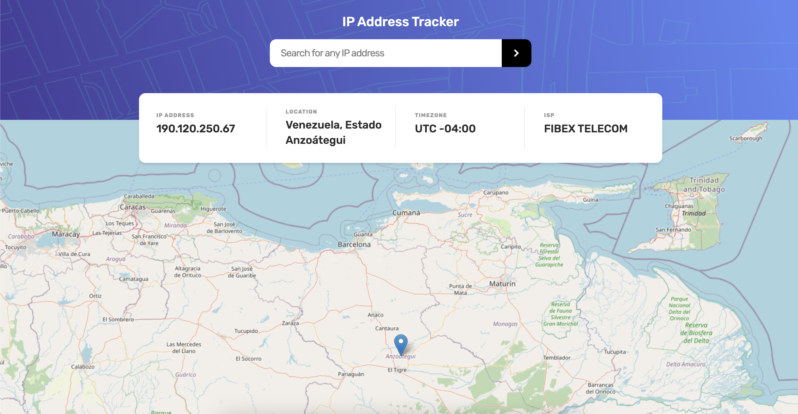

# IP address tracker

This project is a simple IP address tracker built using React, TypeScript, React Query, and Leaflet. It allows users to enter an IP address and see information about the associated location, timezone, ISP, and more.

## Table of contents

- [Overview](#overview)
  - [The challenge](#the-challenge)
  - [Screenshot](#screenshot)
  - [Links](#links)
- [Built with](#built-with)
- [Author](#author)

## Overview

### The challenge

Users should be able to:

- View the optimal layout for each page depending on their device's screen size
- See their own IP address on the map on the initial page load
- Search for any IP addresses and see the key information and location

### Screenshot

### Links

- Live Site URL: [https://ip-address-tracker-ten-beta.vercel.app/](https://ip-address-tracker-ten-beta.vercel.app/)

## Built with

- Semantic HTML5 markup
- Mobile-first workflow
- Flexbox
- [Ipify](https://www.ipify.org/) - Public IP Address API
- [Nominatim](https://nominatim.org/) - Open-source geocoding API
- [React leaflet](https://react-leaflet.js.org/) - Leaflet maps
- [TypeScript](https://www.typescriptlang.org/) - Strongly typed javascript
- [TailwindCSS](https://https://tailwindcss.com/) - For styles
- [React](https://reactjs.org/) - JS framework
- [Tanstack Query](https://tanstack.com/query/latest) - Asynchronous state management

## Author

- Website - [Add website](https://www.your-site.com)
- Linkedin - [Gabriel Marcano](https://www.linkedin.com/in/gabriel-e-marcano/)

This is a solution to the [IP address tracker challenge on Frontend Mentor](https://www.frontendmentor.io/challenges/ip-address-tracker-I8-0yYAH0).
